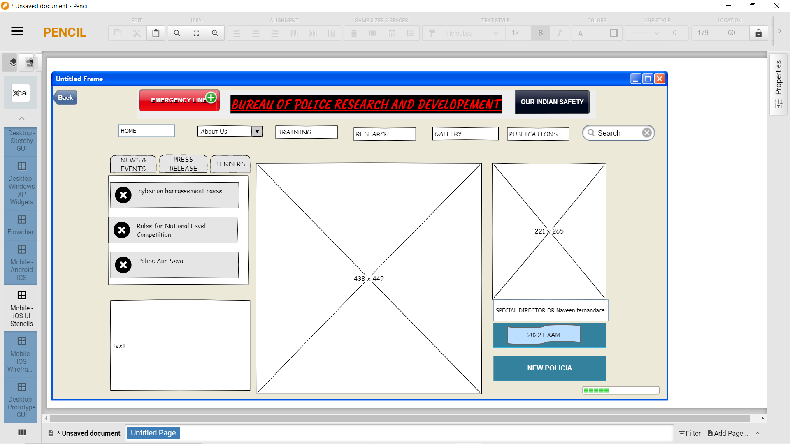
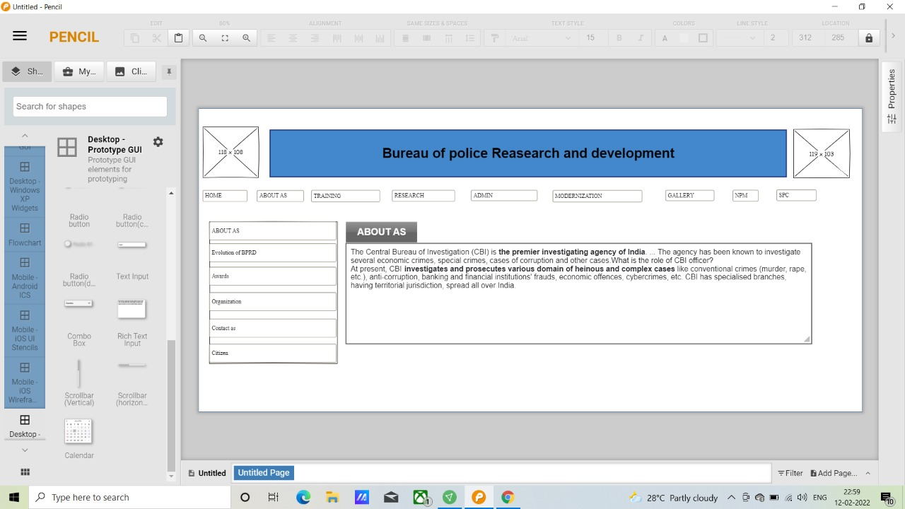
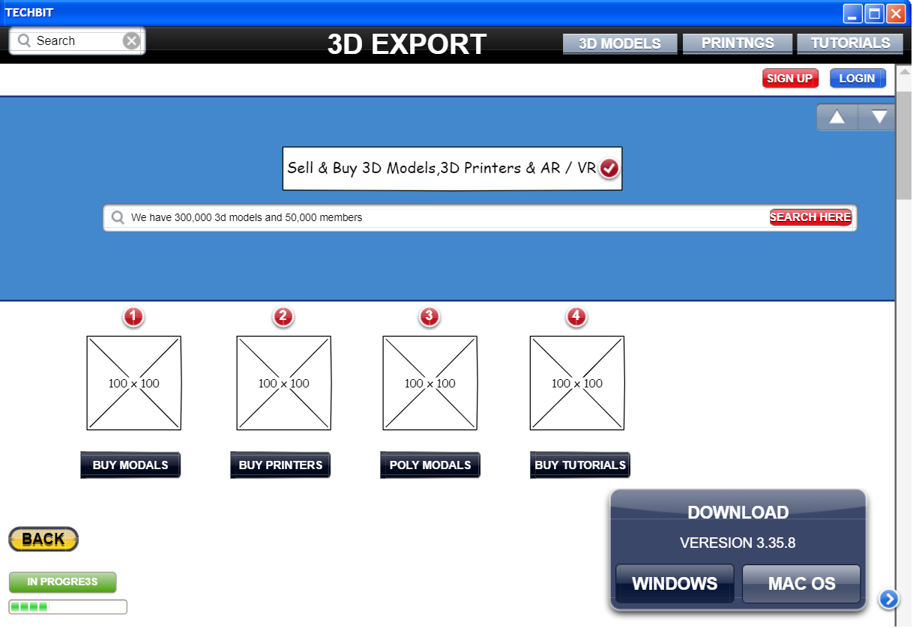

# Wire frame for a website

## AIM:
To design a wire frame for a website.

## DESIGN STEPS:

### Step 1:
Install pencil software.

### Step 2:
Using pencil add contents and texts for webpage model.

## OUTPUT:

### A common webpage:

## Result:
Thus a wire frame is designed for a given website.
